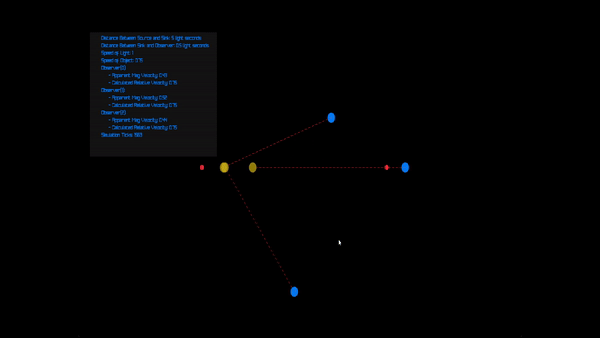

# Sim1

## Controls
* P - pause/resume simulation
* O - show/hide the actual moving object and propogating signals
* L - show/hide the observed positions and the red dotted lines
* K - show/hide the calculated position and the green dotted lines
* R - restart the simulation

## Legend:
* Bright yellow dot - moving object
* Yellow rings - light signals propogating
* Blue dots - observers with relative velocity 0 to eachother
* Transparent yellow dot - where an observer has last seen the object
* Small blue dot - where an observer thinks the object is currently
* Red/green dotted lines - just to mark which dot is from which observer

## About

This simulation is not from a "real" observer. Instead it's more showing what was/is happening
after the fact. You should think of it as: What the camera is showing is a recreation of the observations made.
That's so that we can see the true position of the ship (yellow dot) at time T as well as where the three observers
(blue dots) have observed the ship to be.

The point is to show at time T that all three observers see the ship at different locations
and with vastly different _apparent_ velocities, however they can all calculate
the current relative velocity and also determine where the ship currently is.

Note, because the simulation includes an acceleration (ship goes back and forth)
there are times where the observers miscalculate _where_ the ship is as they have yet
to see the acceleration take place

As the object moves, its signal reaches some observers before others and at different
doppler shifted amounts. Each observer calculates the apparent velocity (average distance observed over time it was observed in)
and then, knowing the distance from each point of observation, calculates what that observer
believe the relative velocity to be and where that object should be.

To make the math easy, C is 1, the object's starting velocity is (.75, 0)

What the simulation is showing:
* The three observers will see the object at different positions at the same time
* Each observer sees a different apparent velocity based on angle to the object
* **The observer that is colinear with the object's motion sees an apparent velocity with magnitude 3**
* All three observers calculate the same relative velocity for the object
* All three observers agree on the positon of the object as long as the object's velocity has not changed (undergone acceleration)

Side fun note: Even if you add a non-instantaneous acceleration, there is a time interval where the observers do not agree on the object's current position
as some observers have yet to see the change in velocity.

Fun note, while not actually possible, if you set the object's speed to > 1, you get some interesting
artifacts like seeing the object in two places at once if you're at certain angles and high enough speeds,
or seeing the object move backwards to its origin if you're head-on

## TODO:
* Apply special relativity to change coordinates into the object's POV and have it observe the observers
* Change object's relative velocity at runtime
* Apply blue/red shift to the object's colors an amount equal to the actual blue/red shift observed